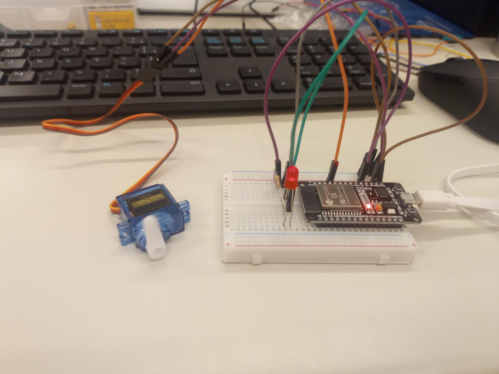

# Sensor de Movimento para Ligar o LED e Controlar o Servo Motor 💡🤖

### Materiais Necessários 🛠️:

ESP32 ou ESP8266 (Microcontrolador) 🖥️

Servo Motor (Com fio de controle, alimentação e terra) ⚙️

LED (Para indicar o funcionamento do projeto) 💡

Resistor de 220Ω (Para o LED) 🔌

Protoboard (Breadboard) e Fios de Conexão 🔗

Cabo USB (Para conectar o microcontrolador ao computador) 📡

Software: Arduino IDE ou PlatformIO (Para programar o microcontrolador) 💻

### Passo 1: Conectar os Componentes 🔌

ESP32/ESP8266:

Conecte o pino 5V do ESP32/ESP8266 ao trilho + da protoboard (para alimentação). ⚡

Conecte o pino GND do ESP32/ESP8266 ao trilho - da protoboard (terra). 🌍

LED:

Conecte o pino positivo (ânodo) do LED ao pino de controle do ESP32/ESP8266 (por exemplo, pino 23). 💡

Conecte o pino negativo (cátodo) do LED a um resistor de 220Ω e depois ao trilho - (terra) da protoboard. 🔴

Servo Motor:

Conecte o fio VCC do servo motor ao pino 5V da protoboard (alimentação). 🔋

Conecte o fio GND do servo motor ao pino GND da protoboard (terra). ⚡

Conecte o fio de controle (geralmente de cor amarela ou laranja) ao pino D12 do ESP32/ESP8266 (ou outro pino digital de sua escolha). 🎛️

Fios de Conexão:

Utilize fios jumper para fazer todas as conexões corretamente entre a protoboard e o microcontrolador. 🔌

### Passo 2: Programação 💻

Abra o Arduino IDE e selecione a placa correta (ESP32 ou ESP8266). 🖥️

Se ainda não tiver a biblioteca do servo motor instalada, vá até Sketch > Incluir Biblioteca > Gerenciar Bibliotecas... e procure por Servo, instalando-a. 📚

### Passo 3: Carregar o Código ⬆️

Conecte o seu ESP32/ESP8266 ao computador via cabo USB. 🔌

Selecione a porta correta em Ferramentas > Porta. ⚙️

Clique em Carregar para enviar o código para o microcontrolador. 🚀

Passo 4: Testando o Projeto 🧪

Após o upload do código, o servo motor deverá começar a se mover de 0° a 180° e vice-versa. 🔄

O LED acenderá assim que o circuito for energizado e o código começar a rodar. 💡

